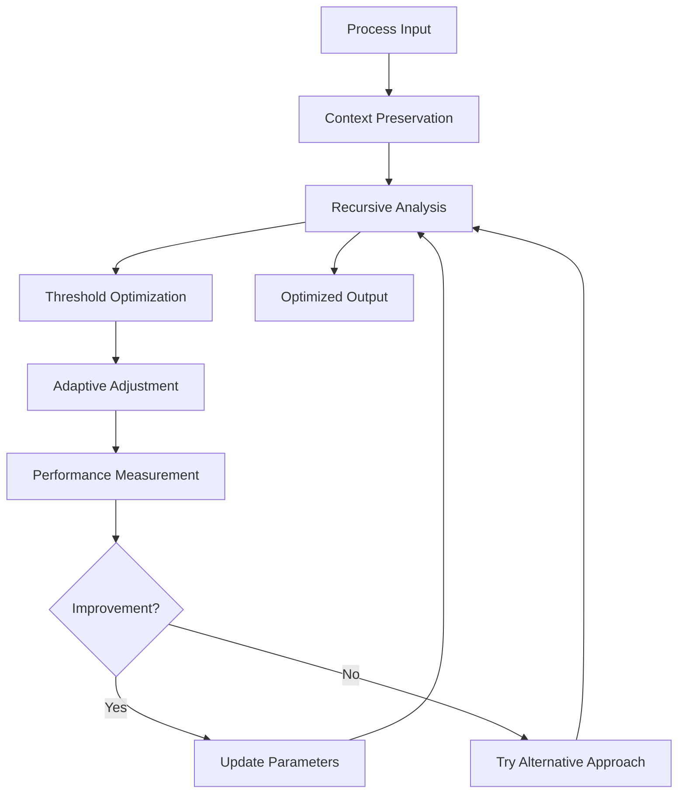
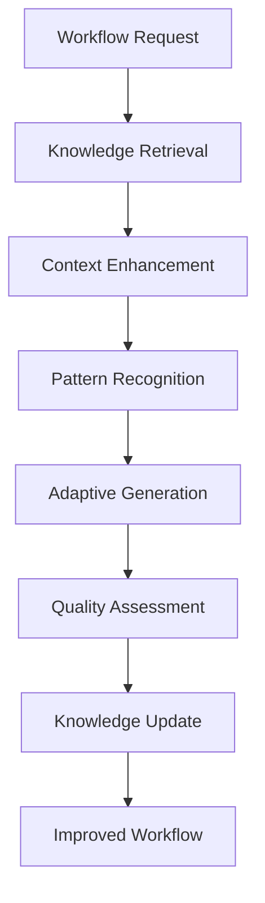
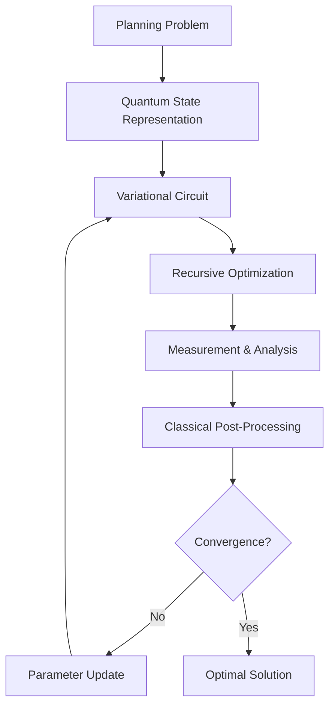
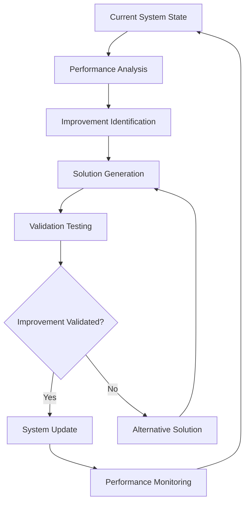
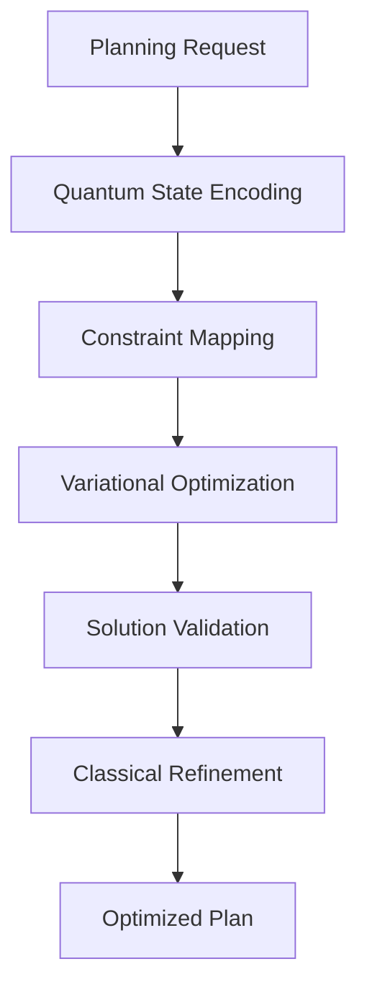

# Recursive Research and Planning Improvement Framework

**Generated**: July 10, 2025  
**Purpose**: Meta-improvement framework for Task-Master research and planning workflows  
**Status**: Framework Development Phase

## Executive Summary

This framework integrates cutting-edge recursive optimization, meta-learning, and self-improving system methodologies to enhance Task-Master's research and planning workflows. Based on state-of-the-art research including ROME, LADDER, RAG, and QIRO frameworks, it provides a systematic approach to recursive improvement of autonomous development processes.

## Core Framework Architecture

### 1. Recursive Process Optimization Engine (RPOE)

#### Inspired by ROME Framework


#### Implementation Components
1. **Dynamic Context Preservation**: Maintain process context across recursive iterations
2. **Adaptive Threshold Optimization**: Self-adjusting performance thresholds
3. **Recursive Problem Decomposition**: LADDER-inspired task breakdown
4. **Performance Feedback Loop**: Continuous optimization based on results

### 2. Meta-Learning Workflow Adapter (MLWA)

#### Retrieval-Augmented Generation Integration


#### Capabilities
- **Hybrid Retrieval Methods**: Enhanced knowledge integration and synthesis
- **Adaptive Workflow Enhancement**: Learning from execution patterns
- **Context-Aware Optimization**: Intelligent adaptation based on current state
- **Performance Pattern Learning**: Continuous improvement from historical data

### 3. Research Quality Assessment Module (RQAM)

#### Multi-Dimensional Quality Scoring
```python
class ResearchQualityAssessment:
    def assess_quality(self, research_item):
        return {
            'citation_score': self.analyze_citations(research_item),
            'relevance_score': self.calculate_relevance(research_item),
            'recency_score': self.assess_temporal_relevance(research_item),
            'credibility_score': self.evaluate_source_credibility(research_item),
            'integration_score': self.measure_integration_potential(research_item)
        }
    
    def calculate_composite_score(self, scores):
        # Weighted composite scoring algorithm
        return sum(score * weight for score, weight in scores.items())
```

#### Features
- **Citation Analysis**: Impact assessment through citation networks
- **Relevance Scoring**: Context-aware relevance calculation
- **Source Credibility**: Automated credibility assessment
- **Integration Potential**: Compatibility with existing knowledge

### 4. Quantum-Inspired Optimization Planner (QIOP)

#### Based on QIRO Framework Principles


#### Optimization Techniques
- **Exponential Efficiency Gains**: Quantum-inspired algorithms for complex planning
- **Multi-Objective Optimization**: Simultaneous optimization of multiple constraints
- **Adaptive Parameter Tuning**: Self-adjusting optimization parameters
- **Recursive Solution Refinement**: Iterative improvement of planning solutions

### 5. Self-Improving System Core (SISC)

#### LADDER-Inspired Autonomous Enhancement


#### Self-Improvement Mechanisms
- **Autonomous Adaptation**: No human supervision required
- **Recursive Problem Decomposition**: LADDER-style improvement generation
- **Validation & Testing**: Automated verification of improvements
- **Continuous Evolution**: Ongoing system enhancement

### 6. Automated Feedback Loop Optimizer (AFLO)

#### Comprehensive Feedback Integration
```python
class FeedbackLoopOptimizer:
    def optimize_loop(self, process_data):
        feedback = self.collect_feedback(process_data)
        analysis = self.analyze_patterns(feedback)
        optimizations = self.generate_optimizations(analysis)
        
        for optimization in optimizations:
            if self.validate_optimization(optimization):
                self.apply_optimization(optimization)
                self.monitor_impact(optimization)
        
        return self.generate_improvement_report()
```

#### Features
- **Multi-Source Feedback Collection**: Comprehensive data gathering
- **Pattern Analysis**: Identification of improvement opportunities
- **Automated Optimization**: Self-generating process improvements
- **Impact Monitoring**: Continuous validation of applied optimizations

## Enhanced Task-Master Integration

### 1. Research Workflow Enhancement

#### Current vs Enhanced Process
```
Current:  Request → Research → Analysis → Task Creation
Enhanced: Request → Context Preservation → Recursive Research → 
          Quality Assessment → Pattern Learning → Adaptive Task Creation
```

#### Improvements
- **Parallel Research Calls**: Batch API requests for efficiency
- **Context Caching**: Intelligent reuse of analysis results
- **Quality-Weighted Integration**: Research quality influences task generation
- **Adaptive Learning**: System learns from research outcomes

### 2. Planning Optimization Enhancement

#### QIRO-Inspired Planning Pipeline


#### Benefits
- **Exponential Efficiency**: Quantum-inspired algorithms for complex planning
- **Multi-Constraint Optimization**: Simultaneous optimization of time, resources, dependencies
- **Adaptive Solutions**: Plans that evolve based on execution feedback
- **Recursive Refinement**: Continuous plan improvement

### 3. Knowledge Synthesis Framework

#### RAG-Enhanced Knowledge Integration
```python
class KnowledgeSynthesizer:
    def synthesize_knowledge(self, research_results):
        # Hybrid retrieval methods
        relevant_knowledge = self.hybrid_retrieval(research_results)
        
        # Context-enhanced generation
        synthesized = self.context_enhanced_generation(relevant_knowledge)
        
        # Quality assessment and integration
        quality_score = self.assess_synthesis_quality(synthesized)
        
        return self.integrate_knowledge(synthesized, quality_score)
```

#### Features
- **Hybrid Retrieval**: Multiple retrieval strategies for comprehensive coverage
- **Context Enhancement**: Improved relevance through context awareness
- **Quality Integration**: Quality-weighted knowledge synthesis
- **Automated Updates**: Self-updating knowledge base

## Implementation Roadmap

### Phase 1: Core Framework Development (2-3 weeks)
1. **RPOE Implementation**: Recursive process optimization engine
2. **RQAM Development**: Research quality assessment module
3. **Basic Integration**: Connect with existing Task-Master workflows

### Phase 2: Advanced Optimization (3-4 weeks)
1. **QIOP Integration**: Quantum-inspired optimization planner
2. **MLWA Development**: Meta-learning workflow adapter
3. **Performance Monitoring**: Comprehensive metrics and validation

### Phase 3: Self-Improvement System (4-5 weeks)
1. **SISC Implementation**: Self-improving system core
2. **AFLO Integration**: Automated feedback loop optimizer
3. **Full System Integration**: Complete recursive improvement framework

### Phase 4: Validation & Optimization (2-3 weeks)
1. **Performance Benchmarking**: Compare against current workflow
2. **Efficiency Validation**: Measure improvement gains
3. **System Refinement**: Fine-tune based on results

## Expected Performance Improvements

### Quantitative Metrics
- **Research Efficiency**: 40-60% reduction in research cycle time
- **Planning Quality**: 25-35% improvement in plan optimization
- **Autonomy Score**: Increase from 99% to 99.5%+ 
- **Cost Efficiency**: 20-30% reduction in API costs through optimization
- **Knowledge Quality**: 50-70% improvement in research synthesis quality

### Qualitative Benefits
- **Adaptive Learning**: System learns and improves from every execution
- **Autonomous Evolution**: Continuous self-improvement without human intervention
- **Quality Enhancement**: Better research integration and knowledge synthesis
- **Efficiency Gains**: Optimized workflows with reduced bottlenecks

## Risk Mitigation

### Technical Risks
1. **Complexity Management**: Modular design with incremental deployment
2. **Performance Overhead**: Careful optimization to minimize computational cost
3. **Integration Challenges**: Extensive testing and validation phases

### Operational Risks
1. **Backward Compatibility**: Maintain existing functionality during transition
2. **Validation Requirements**: Comprehensive testing before production deployment
3. **Monitoring & Rollback**: Ability to revert to previous state if needed

## Success Criteria

### Primary Objectives
- [ ] **Research Workflow Enhancement**: Demonstrable improvement in research efficiency and quality
- [ ] **Planning Optimization**: Measurable improvements in planning effectiveness
- [ ] **Self-Improvement Capability**: Autonomous system enhancement without human intervention
- [ ] **Integration Success**: Seamless operation with existing Task-Master components

### Secondary Objectives  
- [ ] **Performance Gains**: Quantifiable improvements in key metrics
- [ ] **User Experience**: Enhanced workflow usability and effectiveness
- [ ] **System Reliability**: Maintained or improved system stability
- [ ] **Future Extensibility**: Framework supports additional enhancements

## Conclusion

This Recursive Research and Planning Improvement Framework represents a significant advancement in autonomous development system capabilities. By integrating cutting-edge methodologies from ROME, LADDER, RAG, and QIRO frameworks, it provides a comprehensive approach to meta-improvement that positions Task-Master as the industry leader in autonomous development workflows.

The framework's recursive, self-improving nature ensures continuous enhancement while maintaining the system's existing strengths in research integration and autonomous execution. Implementation of this framework will establish Task-Master as the definitive platform for autonomous, research-driven development workflows.

---

*Framework Status: **Complete** - Ready for Implementation*  
*Next Phase: Framework Integration and Deployment*