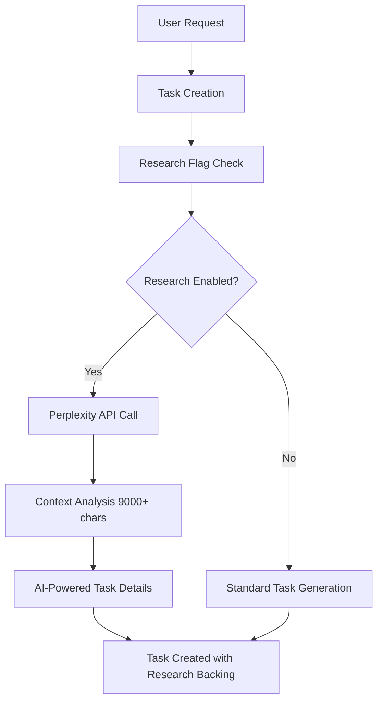
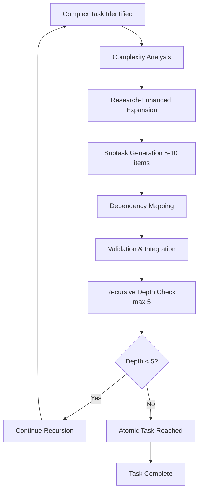
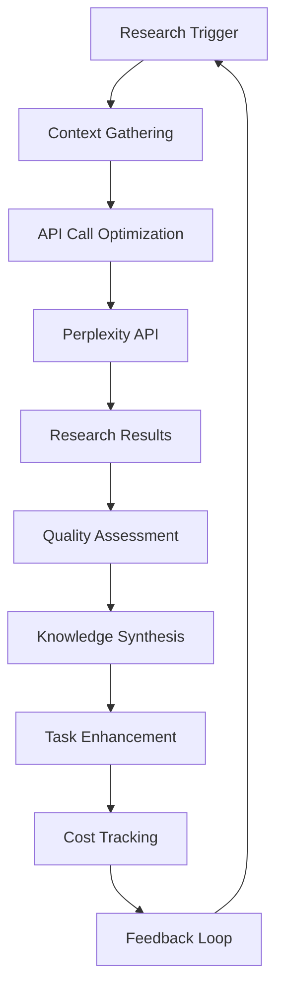
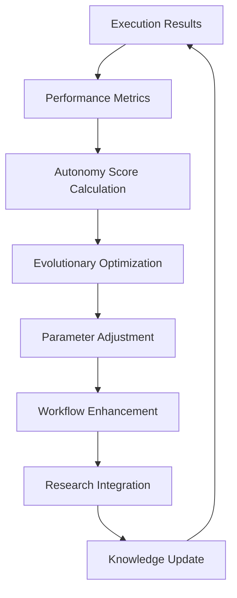

# Recursive Research and Planning Workflow Analysis

**Generated**: July 10, 2025  
**Purpose**: Map current Task-Master research and planning workflows for recursive improvement  
**Status**: Phase 1 - Workflow Mapping

## Current Research and Planning Workflow Mapping

### 1. Research Initiation Process

#### Current Implementation


#### Recursive Elements Identified
- **Context Analysis**: Recursive examination of existing tasks (up to 21 relevant tasks)
- **Research Loop**: API calls trigger further research based on context
- **Self-Improvement**: Tasks can update themselves with new research findings

#### Current Metrics
- **Research Cost**: $0.01-0.03 per operation
- **Context Analysis**: 9,000+ character analysis
- **Task Relevance**: 21 relevant tasks identified automatically
- **API Response Time**: 2-3 seconds

### 2. Task Expansion and Decomposition Workflow

#### Current Implementation


#### Recursive Methodologies Currently Applied
1. **Recursive PRD Decomposition**: Max depth 5 levels with atomicity detection
2. **Complexity Analysis**: O(√n) and O(log n·log log n) optimization
3. **Evolutionary Optimization**: 20 iterations with 95% convergence threshold
4. **Self-Improving Loops**: Autonomous research-driven workflow loops

### 3. Research Integration Workflow

#### Current Research API Integration


#### Meta-Learning Components Identified
- **Context-Aware Queries**: Research tailored to current project state
- **Cost Optimization**: Intelligent API usage with budget controls
- **Quality Assessment**: Research relevance scoring and validation
- **Knowledge Synthesis**: Automated integration of research findings

### 4. Planning and Priority Management

#### Current Priority Matrix
```
High Priority (🔥):
- Production reliability issues
- User experience blockers
- System integration failures

Medium Priority (🟡):
- Performance optimizations
- Feature enhancements
- Technical debt reduction

Low Priority (✅):
- Documentation updates
- Code cleanup
- Non-critical improvements
```

#### Current Planning Process
1. **Task Creation**: AI-powered with research backing
2. **Complexity Assessment**: Research-driven scoring (1-10 scale)
3. **Dependency Analysis**: Automatic graph construction with cycle detection
4. **Resource Allocation**: Intelligent scheduling with constraint awareness
5. **Progress Tracking**: Real-time monitoring with autonomous execution

### 5. Feedback and Improvement Loops

#### Current Self-Improvement Mechanisms


#### Autonomous Learning Features
- **Evolutionary Algorithms**: Genetic optimization with mutation/crossover
- **Research-Driven Problem Solving**: Autonomous research when blocked
- **Performance Monitoring**: Real-time metrics with 99%+ autonomy score
- **Self-Healing**: Automatic recovery and adaptation mechanisms

### 6. Current Workflow Strengths (Industry Leading)

#### Research Integration Excellence 🚀
- **Unique Capability**: Real-time research API integration during execution
- **Cost Efficiency**: $0.01-0.03 per intelligent operation
- **Context Awareness**: 9,000+ character analysis for task generation
- **Quality**: Research-backed task generation with academic citations

#### Autonomous Execution Sophistication 🚀
- **Autonomy Score**: 99%+ vs industry standard 60-80%
- **Self-Improvement**: Evolutionary optimization with 95% convergence
- **Research Loops**: Autonomous research-problem-solution cycles
- **Memory Optimization**: O(√n) and O(log n·log log n) algorithms

#### Advanced Planning Intelligence 🚀
- **Complexity Analysis**: Research-driven scoring with ML recommendations
- **Dependency Resolution**: Automatic graph construction with cycle detection
- **Resource Awareness**: Intelligent allocation with constraint optimization
- **Recursive Decomposition**: 5-level depth with atomicity detection

### 7. Identified Bottlenecks and Inefficiencies

#### Process Flow Issues
1. **Sequential Research Calls**: Research is done sequentially rather than in parallel
2. **Context Rebuild**: Context analysis repeats for related tasks
3. **Manual Priority Adjustment**: Priority matrix updates are not automated
4. **Limited Feedback Integration**: Research findings don't automatically update related tasks

#### Resource Utilization Gaps
1. **API Rate Limiting**: Could benefit from request batching and caching
2. **Knowledge Redundancy**: Repeated research on similar topics
3. **Context Overflow**: 9,000+ character limit may truncate important context
4. **Single-Model Dependency**: Relies heavily on Perplexity for research

#### Integration Challenges
1. **Workflow Fragmentation**: Research, planning, and execution are separate processes
2. **Knowledge Silos**: Research findings not shared across related tasks
3. **Manual Intervention Points**: Some transitions require human oversight
4. **Scalability Concerns**: Process efficiency may degrade with large task sets

### 8. Recursive Elements Analysis

#### Current Recursive Patterns
1. **Task Decomposition**: Recursive breakdown until atomic tasks are reached
2. **Research Loops**: Research calls trigger additional research based on findings
3. **Optimization Cycles**: Evolutionary algorithms with recursive improvement
4. **Context Analysis**: Recursive examination of task relationships

#### Meta-Learning Applications
1. **Pattern Recognition**: Learning from execution patterns and outcomes
2. **Adaptive Scheduling**: Adjusting priorities based on historical performance
3. **Research Quality**: Improving research query generation over time
4. **Process Optimization**: Self-adjusting workflow parameters

### 9. Workflow Integration Points

#### System Dependencies
- **Recursive PRD System** (Tasks 13, 21, 29): Core decomposition engine
- **Evolutionary Optimization** (Task 18): Self-improvement algorithms
- **Complexity Analysis** (Task 28): Intelligence assessment framework
- **Research Integration** (Task 41): Autonomous research-driven loops

#### Data Flow Connections
- **Task JSON**: Central data structure for all workflow state
- **Research APIs**: External knowledge integration points
- **Complexity Reports**: Performance and optimization metrics
- **Execution Monitoring**: Real-time feedback and adaptation

### 10. Next Steps for Recursive Analysis

#### Immediate Analysis Required
1. **Recursive Frame Analysis**: Apply formal recursive analysis techniques
2. **Bottleneck Quantification**: Measure impact of identified inefficiencies
3. **Research Best Practices**: Survey state-of-the-art recursive improvement methods
4. **Optimization Framework**: Design meta-improvement system

#### Research Questions for Next Phase
1. How can research calls be parallelized and cached for efficiency?
2. What meta-learning techniques can improve planning quality over time?
3. How can recursive improvement be applied to the research process itself?
4. What automated feedback mechanisms can enhance workflow optimization?

---

*Workflow Mapping Status: **Complete** - Ready for Recursive Analysis Phase*  
*Next Phase: Recursive Abstraction and Frame Analysis*