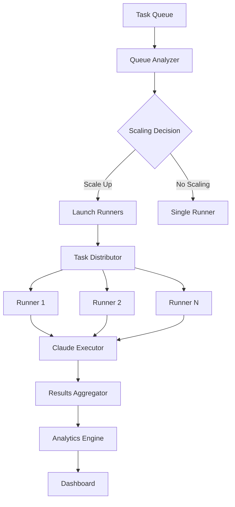

# 🚀 GitHub Actions Scaling for Claude Task Execution

## Overview

This system enables **massive parallel task execution** using GitHub Actions runners with Claude AI integration. It automatically scales runners based on task queue size and executes tasks using Claude as prompts.

## 🎯 Key Features

### 🔄 **Intelligent Scaling**
- **Automatic runner scaling** based on task queue size and complexity
- **Dynamic load balancing** across multiple runners
- **Smart task distribution** with dependency awareness
- **Resource optimization** to minimize costs

### 🤖 **Claude Integration**
- **Full Claude API integration** for task execution
- **Autonomous error recovery** using research loop
- **Task validation** with test strategy execution
- **Performance monitoring** and optimization

### 📊 **Analytics & Reporting**
- **Real-time execution monitoring**
- **Performance analytics** with trend analysis
- **Error pattern detection** and recommendations
- **Visual dashboards** and reports

## 🏗️ Architecture



## 📂 File Structure

```
.github/
├── workflows/
│   ├── claude-task-execution.yml    # Main execution workflow
│   ├── scale-runners.yml           # Dynamic scaling workflow
│   └── results-aggregation.yml     # Analytics and reporting
└── scripts/
    ├── task-distributor.js         # Task distribution logic
    └── claude-integration.py       # Claude API integration

.taskmaster/
├── workflows/
│   ├── autonomous-research-loop.sh  # Error recovery system
│   └── claude-auto-recovery.sh     # Auto-recovery wrapper
└── tasks/
    └── tasks.json                   # Task database
```

## 🚀 Quick Start

### 1. Repository Setup

```bash
# Clone and setup repository
git clone your-repo
cd your-repo

# Ensure required secrets are configured
# - ANTHROPIC_API_KEY
# - PERPLEXITY_API_KEY (optional, for research)
# - GITHUB_TOKEN (automatically provided)
```

### 2. Configure Secrets

Go to **Settings → Secrets and variables → Actions** and add:

```bash
ANTHROPIC_API_KEY=your_claude_api_key_here
PERPLEXITY_API_KEY=your_perplexity_key_here  # Optional
```

### 3. Initialize Task Master

```bash
# Initialize task-master if not already done
task-master init

# Add some sample tasks
task-master add-task --prompt="Create a hello world application" --priority=high
task-master add-task --prompt="Add unit tests" --priority=medium
task-master add-task --prompt="Setup CI/CD pipeline" --priority=low
```

### 4. Trigger Execution

#### **Manual Trigger**
```bash
# Via GitHub web interface
Actions → Claude Task Execution at Scale → Run workflow
```

#### **Automatic Trigger**
- **Push to main**: Automatically triggers when `.taskmaster/tasks/tasks.json` is updated
- **Scheduled**: Runs every 30 minutes during business hours
- **API Trigger**: Via repository dispatch events

## ⚙️ Configuration Options

### Scaling Strategies

| Strategy | Description | Use Case |
|----------|-------------|----------|
| `auto` | Balanced approach with priority weighting | **Recommended** for most cases |
| `aggressive` | More runners for faster execution | High-priority tasks, tight deadlines |
| `conservative` | Fewer runners to reduce costs | Low-priority tasks, cost optimization |
| `manual` | Specify exact runner count | Testing, specific requirements |

### Runner Limits

```yaml
# In workflow dispatch inputs
max_runners: "10"        # Maximum concurrent runners
task_filter: "status:pending"  # Filter tasks to execute
force_scaling: true      # Force scaling even with few tasks
```

### Task Filtering

Filter tasks by various criteria:
- `status:pending` - Only pending tasks
- `priority:high` - Only high-priority tasks
- `dependencies:none` - Tasks with no dependencies

## 🎮 Usage Examples

### Example 1: Scale for High-Priority Tasks

```bash
# Trigger scaling for high-priority tasks only
curl -X POST \
  -H "Authorization: token $GITHUB_TOKEN" \
  -H "Accept: application/vnd.github.v3+json" \
  https://api.github.com/repos/owner/repo/actions/workflows/claude-task-execution.yml/dispatches \
  -d '{
    "ref": "main",
    "inputs": {
      "max_runners": "15",
      "task_filter": "priority:high",
      "force_scaling": "true"
    }
  }'
```

### Example 2: Conservative Scaling

```bash
# Use conservative scaling strategy
curl -X POST \
  -H "Authorization: token $GITHUB_TOKEN" \
  -H "Accept: application/vnd.github.v3+json" \
  https://api.github.com/repos/owner/repo/actions/workflows/scale-runners.yml/dispatches \
  -d '{
    "ref": "main",
    "inputs": {
      "scaling_strategy": "conservative",
      "target_runners": "3"
    }
  }'
```

### Example 3: Monitor Execution

```bash
# Trigger analytics report
curl -X POST \
  -H "Authorization: token $GITHUB_TOKEN" \
  -H "Accept: application/vnd.github.v3+json" \
  https://api.github.com/repos/owner/repo/actions/workflows/results-aggregation.yml/dispatches \
  -d '{
    "ref": "main",
    "inputs": {
      "report_period": "24"
    }
  }'
```

## 📊 Monitoring & Analytics

### Real-Time Monitoring

The system provides comprehensive monitoring:

1. **Execution Progress**: Live tracking of runner status
2. **Success Rates**: Real-time success/failure metrics
3. **Performance Trends**: Execution time and efficiency trends
4. **Error Analysis**: Automatic error pattern detection

### Analytics Dashboard

Access the analytics dashboard at:
```
https://your-username.github.io/your-repo/task-execution-reports/execution_report.html
```

### Key Metrics Tracked

| Metric | Description |
|--------|-------------|
| **Success Rate** | Percentage of tasks completed successfully |
| **Execution Time** | Average and total execution times |
| **Runner Efficiency** | Tasks per runner and resource utilization |
| **Scaling Effectiveness** | How well scaling improves performance |
| **Error Patterns** | Common failure modes and recovery rates |

## 🔧 Advanced Configuration

### Custom Task Distribution

Modify `.github/scripts/task-distributor.js` to customize task distribution logic:

```javascript
// Example: Custom complexity calculation
calculateTaskComplexity(task) {
    let complexity = 1;
    
    // Your custom logic here
    if (task.description.includes('AI') || task.description.includes('ML')) {
        complexity += 3; // AI/ML tasks are more complex
    }
    
    if (task.dependencies && task.dependencies.length > 5) {
        complexity += 2; // Many dependencies increase complexity
    }
    
    return complexity;
}
```

### Custom Claude Prompts

Modify `.github/scripts/claude-integration.py` to customize Claude prompts:

```python
# Example: Custom task execution prompt
task_execution_template = """
You are executing a specialized task with custom requirements:

{custom_context}

Task: {title}
Requirements: {custom_requirements}

Execute with enhanced capabilities and report detailed results.
"""
```

### Environment-Specific Configuration

```yaml
# Add to workflow environment
env:
  EXECUTION_TIMEOUT: 45        # Minutes
  CLAUDE_MODEL: "claude-3-5-sonnet-20241022"
  MAX_RETRIES: 3
  ENABLE_RESEARCH_LOOP: true
```

## 🚨 Error Handling & Recovery

### Automatic Error Recovery

The system includes multiple layers of error recovery:

1. **Task-Level Recovery**: Individual task failures trigger research loop
2. **Runner-Level Recovery**: Runner failures trigger task redistribution  
3. **System-Level Recovery**: Overall system failures trigger scaling adjustments

### Common Issues & Solutions

| Issue | Symptom | Solution |
|-------|---------|----------|
| **Rate Limiting** | 429 errors from Claude API | Automatic backoff and retry |
| **Task Timeout** | Tasks exceeding time limits | Increase timeout or break into subtasks |
| **Dependency Loops** | Tasks stuck in pending | Automatic dependency validation |
| **Resource Exhaustion** | Runners running out of memory | Reduce concurrent tasks per runner |

### Manual Intervention

If automatic recovery fails:

1. **Check Logs**: Review workflow logs for specific errors
2. **Adjust Configuration**: Modify scaling parameters
3. **Reset State**: Clear stuck tasks and restart execution
4. **Contact Support**: For persistent issues

## 💰 Cost Optimization

### Runner Usage Guidelines

- **Use auto scaling** for most workloads (optimal cost/performance)
- **Conservative scaling** for cost-sensitive projects
- **Aggressive scaling** only for time-critical tasks
- **Monitor analytics** to optimize runner counts

### Estimated Costs

| Runner Count | Hours/Month | Estimated Cost |
|--------------|-------------|----------------|
| 1-3 runners | 100 | $20-60 |
| 5-10 runners | 200 | $100-200 |
| 10+ runners | 400+ | $200+ |

*Costs are estimates based on GitHub Actions pricing*

## 🔐 Security Considerations

### API Key Management

- Store all API keys in GitHub Secrets (never in code)
- Use separate keys for different environments
- Rotate keys regularly
- Monitor API usage for anomalies

### Access Control

- Limit workflow triggers to authorized users
- Use branch protection rules
- Monitor workflow execution logs
- Implement approval requirements for production

### Data Privacy

- Task data may be visible in logs
- Sensitive information should be parameterized
- Use private repositories for confidential work
- Consider data retention policies

## 🤝 Contributing

### Development Setup

```bash
# Clone repository
git clone your-repo
cd your-repo

# Install development dependencies
npm install
pip install -r requirements-dev.txt

# Run tests
npm test
python -m pytest
```

### Testing Workflows

```bash
# Test task distribution
node .github/scripts/task-distributor.js balanced 5

# Test Claude integration  
python .github/scripts/claude-integration.py test-task-1

# Test scaling logic
bash .taskmaster/workflows/claude-auto-recovery.sh safe "task-master next"
```

## 📞 Support

### Documentation
- [Task Master AI Documentation](link)
- [Claude API Documentation](https://docs.anthropic.com/)
- [GitHub Actions Documentation](https://docs.github.com/en/actions)

### Community
- GitHub Issues: Report bugs and feature requests
- Discussions: General questions and ideas
- Wiki: Additional examples and tutorials

### Enterprise Support
For enterprise deployments and custom requirements, contact the development team.

---

## 🎉 Get Started Now!

1. **Fork this repository**
2. **Configure your API keys**
3. **Add some tasks to your queue**
4. **Trigger your first scaled execution**
5. **Watch Claude execute tasks at scale!**

**The future of autonomous development is here!** 🚀